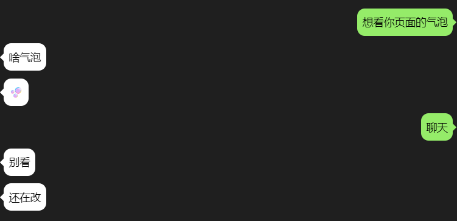

# 文字气泡


## 使用

```html
<div class="chat-bubble chat-bubble-from-right chat-bubble-top" style="--chat-bubble-background-color: #95EC69;
       --chat-bubble-border-color: rgba(0, 0, 0, 0);
       --chat-bubble-text-color: #000"
       >
    想看你页面的气泡
</div>
```